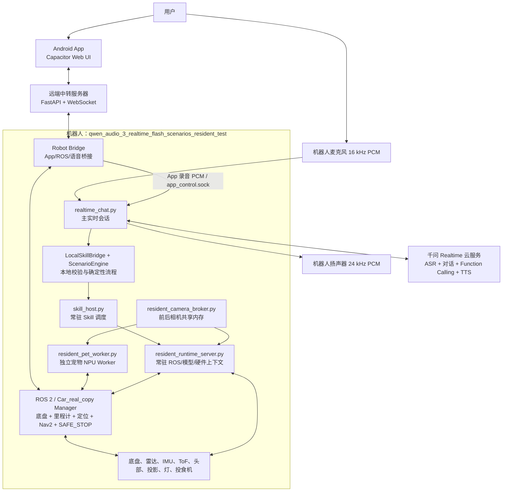
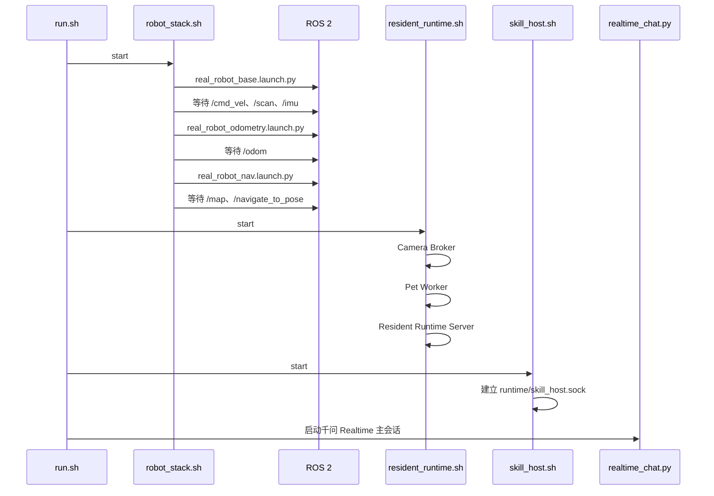
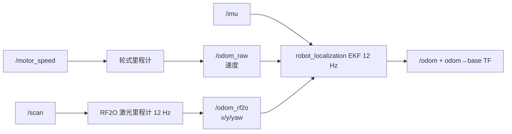
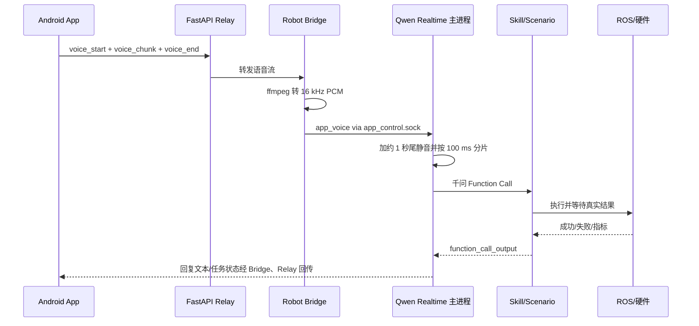

# qwen_audio_3_realtime_flash_scenarios_resident_test 软件架构说明

> 文档对象：`/home/test/qwen_audio_3_realtime_flash_scenarios_resident_test`  
> 分析日期：2026-08-18  
> 分析方法：仅静态阅读项目代码、配置、启动脚本和测试；未启动机器人、ROS、相机、投影或其他硬件。  
> 安全说明：本文不记录千问 API Key、App Token、Robot Token、米家认证信息等秘密值。

## 1. 项目定位

这个项目是一套运行在机器人上的“端到端实时语音 + 确定性场景编排 + 常驻机器人能力 + Android App”系统。

它与早期“本地 ASR + DeepSeek + 本地 TTS”的分段式链路不同：现场麦克风语音直接送入阿里云千问 `qwen-audio-3.0-realtime-flash` 的长连接，会话同时完成语音理解、对话决策、Function Calling 和语音合成。模型需要操作机器人时，只能通过本地 Skill 接口；固定演示场景由本地场景编译器展开，不能让模型自由拼接受保护的原子动作。

项目自身不包含底盘驱动和 Nav2 的完整源码副本。它只读加载 `/home/test/Car_real_copy`，只启动其中的 `MappingNavigationManager`，再通过 motion controller 的受保护 Topic/Service 和本地 Unix Socket 调用机器人能力；本项目不会修改 `Car_real_copy`。

系统可概括为六层：

1. Android App、机器人现场麦克风两类交互入口；
2. 千问 Realtime 实时语音会话；
3. 本地意图校验、场景编译和执行；
4. 常驻 Skill、视觉模型和硬件适配层；
5. ROS 2 底盘、里程计、定位和 Nav2；
6. 相机、雷达、IMU、电机、头部、投影、灯和投食机等设备。

## 2. 总体部署拓扑



部署上有三个位置：

| 位置 | 组件 | 作用 |
|---|---|---|
| Android 手机 | Capacitor App | 语音按住说、程序启停、地图、视频、导航、微动和家具控制 |
| 中转服务器 | FastAPI + WebSocket | 让手机和机器人跨网络连接，保存最新状态、地图和视频索引 |
| 机器人 | Qwen 会话、场景引擎、Skill Host、Resident、Robot Bridge、ROS 2 | 完成实时对话、场景执行、模型推理和硬件控制 |

## 3. 项目目录与职责

| 路径 | 主要职责 |
|---|---|
| `run.sh` | 前台总入口；按顺序启动 ROS、Resident、Skill Host 和实时语音 |
| `resident_service.sh` | 后台服务入口，供 App 启动/停止整套千问机器人程序 |
| `robot_stack.sh` | 只启动/停止 `/home/test/Car_real_copy` 的 MappingNavigationManager，并等待其权威状态 |
| `realtime_chat.py` | 麦克风/扬声器、千问 WebSocket、Function Calling、App 控制 Socket、记忆 |
| `realtime_core.py` | 千问会话参数、事件状态机、音频事件和断线重连基础逻辑 |
| `skill_event_audio.py` | 运动计数等实时事件的独立千问播报通道 |
| `local_skills.py` | Skill 工具目录、参数过滤、场景路由、受保护动作拦截 |
| `scenario_engine.py` | 场景目录加载、计划编译、依赖执行、结果归因和播报选择 |
| `scenarios/` | 固定场景、步骤、条件、成功/失败话术和固定点引用 |
| `skill_host.py` / `skill_host.sh` | 常驻本地 Skill 服务，避免每次重新启动 Python/模型 |
| `skill_runner.py` | Skill 执行适配、参数清洗、Resident Socket 通信和兼容回退 |
| `robot_skills/` | Skill 规格、执行器、视觉模型、硬件配置、Resident 三进程 |
| `android_app/web/` | App 的 HTML/CSS/JavaScript 界面 |
| `android_app/android/` | Capacitor Android 原生壳和 Gradle 工程 |
| `android_app/server/` | 中转服务器 FastAPI 后端 |
| `android_app/robot_bridge/` | 机器人与中转服务器、ROS、语音主进程之间的桥接 |
| `runtime/` | Socket、PID、日志、App 语音临时文件、对话记忆等隔离运行状态 |

## 4. 进程架构与生命周期

### 4.1 机器人核心启动顺序

执行 `bash run.sh --execute-skills` 时，顺序如下：



`robot_stack.sh` 会先检查 ROS 是否已由外部启动。如果发现完整外部栈，它只附着使用，不重复启动，也不会在退出时关闭外部进程。如果由本项目启动，则失败时回滚，正常结束时按 `navigation → odometry → base` 逆序停止。

App 使用 `resident_service.sh` 后台管理核心。服务只有在 `runtime/app_control.sock` 已建立并且实时会话报告 `connected=true` 后，才把启动判定为成功。Robot Bridge 可独立于核心常驻，因此 App 在核心停止时仍能看到“未运行”状态并再次启动程序。

### 4.2 运行进程清单

| 进程 | 常驻 | 主要资源所有权 |
|---|---:|---|
| `realtime_chat.py` | 是 | 麦克风、扬声器、千问主 WebSocket、App 控制 Socket |
| `skill_host.py` | 是 | Skill 注册表、场景调用入口、串行请求边界 |
| `resident_camera_broker.py` | 是 | `/dev/video22`、`/dev/video31` 的唯一 V4L2 打开权 |
| `resident_pet_worker.py` | 是 | 宠物 RKNN 模型、宠物搜索/跟踪、独立 NPU 设备 |
| `resident_runtime_server.py` | 是 | rclpy、Nav2 Client、控制 Publisher、主视觉模型和硬件上下文 |
| `bridge.py` | 是 | App WebSocket、地图/位姿遥测、App 指令和视频上传 |
| ROS launch 进程 | 是 | 底盘、传感器、融合里程计、Cartographer、Nav2 |

## 5. 千问实时语音子系统

### 5.1 音频和会话

- 模型：`qwen-audio-3.0-realtime-flash`。
- 输入：PCM16、16 kHz、单声道。
- 输出：PCM16、24 kHz、单声道。
- 默认轮次检测：`smart_turn`，也支持 `server_vad`。
- 默认音色：`longanqian`。
- 一个长连接最多保留 50 轮上下文，断线后按错误类型决定是否重连。
- 默认 `speaker-safe`：播放期间抑制麦克风，并在播放结束后保留约 0.5 秒尾部保护，降低机器人听到自己声音的概率。
- 可选 `full-duplex`：用户说话时立即停止当前播放并取消本次模型回复。

麦克风和扬声器使用文件锁，防止另一个程序同时占用。输出音频采用队列播放，并切成约 20 ms 小片，便于快速打断。

### 5.2 Function Calling

千问不直接执行系统命令。`realtime_chat.py` 把本地 Skill 的 JSON Schema 作为工具暴露给模型。收到 Function Call 后：

1. 等待当前用户转写完整，避免拿上一轮文本验证本轮动作；
2. 按“函数名 + 参数”做单轮去重；
3. 交给 `LocalSkillBridge` 校验和路由；
4. Skill 完成后把结构化结果回送千问；
5. 千问根据真实结果生成语音回复。

系统提示明确要求：设备操作必须使用工具；执行结果未确认前不能口头声称成功；受保护场景不能拆成原子动作；用户未提出有副作用的操作时不能主动执行。

### 5.3 实时运动计数播报

俯卧撑、引体向上和深蹲执行时，Skill 会产生 `ready`、`count` 等流式事件。为了避免主 Function Call 长时间占用导致计数积压，项目维护一个单独预连接的千问 Realtime 播报通道：

- 单次计数事件由独立通道立即合成和播放；
- 音色与主会话一致；
- 运动结束总数和最终结果仍由主会话统一回复；
- 这不是本地 TTS，仍依赖千问云端链路。

### 5.4 记忆和日志

- 对话历史：`runtime/memory/conversation_history.jsonl`，上限 1000 条。
- 长期记忆：`runtime/memory/long_term_memory.json`，上限 200 条事实。
- 默认不会把历史设备状态重新注入模型，避免把旧的“灯已开/投影已关”误当作实时状态。
- 日志：`runtime/realtime_chat.jsonl`，记录事件和耗时，不记录原始音频和 API Key。
- 长期记忆接口拒绝保存明显的密码、Token 等敏感信息。

## 6. 场景编排与越界防护

### 6.1 为什么不能让模型自由拼原子动作

固定演示包含导航、头部、投影、身份识别、计数和清理。如果全部由模型自由生成，容易发生漏步骤、顺序错误、失败后继续执行或错误播报。当前项目因此采用“双层决策”：

- 千问只判断用户想做哪个业务；
- 本地 `ScenarioEngine` 决定该业务必须执行的确切步骤。

`push_up`、`pull_up`、`squat`、`welcome_projection`、`projector_control` 等受保护原子工具不直接暴露给千问。模型看到的是 `run_robot_scenario`。即使模型尝试调用受保护原子动作，本地层也会拒绝或重路由到对应场景。

### 6.2 场景识别

`LocalSkillBridge` 采用本地确定性规则和主题证据验证，支持常见 ASR 同音字、模糊匹配和拼音修复，同时会排除：

- “能不能做……”这类能力咨询；
- “不要、取消、别执行”等否定命令；
- 只讨论场景、不要求执行的信息性问题；
- 与当前场景无关的孤立关键词；
- 同一轮内重复触发的同一场景。

回家欢迎场景默认只在首次问候触发，除非用户明确要求重放。

### 6.3 计划执行语义

场景被编译成带 ID、依赖、条件和结果组的步骤图。执行器按声明顺序运行：

- `success` 依赖：上一步必须成功；
- `completion` 依赖：上一步只要结束即可，用于关闭投影、头部复位等清理；
- `run_if`：支持全部成功、全部结束、任一步失败、字段值判断等条件；
- 未满足前置条件的步骤标记为 `prerequisite_not_satisfied`，不能误报成真正执行失败；
- 最终播报从场景定义的 `outcome_groups` 选择，并携带实际失败阶段。

同一时刻只允许一个场景执行，防止两个流程同时控制底盘、头部或投影。

### 6.4 当前固定场景

| 场景 | 实际流程摘要 |
|---|---|
| 客厅灯光服务 | 开灯与导航到白墙点可并行，随后用前相机检查照明 |
| 俯卧撑陪练 | 白墙点 → 抬头 → 身份锁定与计数 → 关闭投影 → 头部平视 |
| 引体向上陪练 | 白墙点 → 抬头 → 身份锁定与计数 → 条件清理 → 头部平视 |
| 深蹲陪练 | 白墙点 → 抬头 → 身份锁定与计数 → 条件清理 → 头部平视 |
| 寻找宠物 | 白墙点、书房点、原点按顺序搜索，找到后停止继续搜索 |
| 找到并喂豆豆 | 多点搜索；确认找到后才允许投食 |
| 开始会议投影 | 导航书房投影点 → 抬头 → 启动会议内容 |
| 关闭会议投影 | 关闭投影 → 头部恢复平视 |
| 欢迎回家 | 低头 → 播放欢迎投影约 3 秒 → 恢复平视 |
| 指定地点找宠物 | 导航到给定固定点 → 搜索 |
| 原地找宠物 | 不导航，只在当前位置搜索 |
| 休息灯光 | 关灯与返回白墙点并行执行 |

当前这份测试项目的“欢迎回家”场景不包含导航到书房，也不包含人物追踪。

## 7. Skill 与常驻模型架构

### 7.1 Skill 分组

项目当前注册 29 个可用 Skill：

| 分类 | Skill |
|---|---|
| 底盘微动 | `move_forward`、`move_backward`、`move_left`、`move_right` |
| 导航 | `navigation_goto`、`navigation_list` |
| 头部/投影 | `head_control`、`projector_control`、`welcome_projection` |
| 摄像 | 前/后/通用相机的拍照和录像 |
| 视觉身份 | `environment_perception`、`face_recognition`、`face_registration` |
| 跟踪 | `person_tracking`、`pet_tracking` |
| 运动 | `push_up`、`pull_up`、`squat` |
| 家具 | `light_control`、`feeder_control` |
| 信息/提醒 | `realtime_information`、提醒创建/查询/取消 |

`fan_control` 的实现已移除，因此明确禁用，不会被模型调用。

### 7.2 三层本地调用链

```text
realtime_chat.py
  └─ LocalSkillBridge
      └─ runtime/skill_host.sock
          └─ skill_host.py / skill_runner.py
              └─ robot_skills/runtime/resident/skills.sock
                  └─ resident_runtime_server.py
                      ├─ ROS Topic / Nav2 Action
                      ├─ 常驻视觉模型
                      └─ 灯、投食机、投影等硬件适配
```

`skill_host.py` 使用 Unix Socket `0600` 权限并串行化请求。正常执行走常驻 Resident；只有在请求尚未发送、可以确定没有产生副作用时，才允许兼容回退。请求已发送但结果不确定时绝不自动重试，防止移动、投食、开关投影被重复执行。

### 7.3 Resident 三进程

1. **Camera Broker**：唯一打开前后摄像头的进程，把最新帧写入共享内存。
2. **Pet Worker**：独占宠物检测使用的独立 RKNN/NPU 设备，承担宠物 360°搜索和跟踪。
3. **Resident Runtime Server**：常驻 rclpy、导航客户端、主视觉模型和硬件控制模块，处理绝大部分 Skill。

当前相机配置：

| 相机 | 设备 | 分辨率 | 目标帧率 | 共享内存 |
|---|---|---:|---:|---|
| 前相机 | `/dev/video22` | 640×480 | 15 FPS | `/dev/shm/v11_resident_camera_front.bin` |
| 后相机 | `/dev/video31` | 640×480 | 15 FPS | `/dev/shm/v11_resident_camera_back.bin` |

视觉消费者读取“最新帧”而不是积压处理历史帧，录像另走异步写入队列，避免编码阻塞推理。

### 7.4 常驻模型和加速设备

Resident 启动时预加载或绑定以下模型：

| 功能 | 实现 |
|---|---|
| 人体检测 | YOLO RKNN |
| 行人身份 | ReID RKNN |
| 人脸检测 | RetinaFace |
| 人脸特征 | FaceNet RKNN |
| 姿态 | MediaPipe Pose；俯卧撑路径支持 RKNN Pose 后端 |
| 宠物检测 | 独立 RKNN3 Worker 和独立 NPU 设备 |

运动识别大致链路为：共享内存取最新帧 → YOLO 找人 → Face/ReID 锁定同一目标 → 姿态关键点 → 动作状态机计数 → 生成标注录像 → 推送实时计数事件。身份判定采用“人脸 + ReID”并趋向失败闭锁：身份证据不足时不应随便切换成另一个人。

### 7.5 资源互斥

Resident 通过资源协调器保护以下资源：底盘、头部、前相机、投影、主 NPU、宠物 NPU、运动会话、灯设备、投食机和提醒存储。默认资源等待窗口约 0.25 秒；拿不到资源时返回明确忙碌状态，而不是并发争抢硬件。

## 8. ROS 2、底盘、里程计、定位和导航

### 8.1 外部 ROS 工作空间边界

所有真实运动能力只能来自：

```text
/home/test/Car_real_copy
```

项目不修改该工作空间。`robot_stack.sh` 固定只启动：

1. `mapping_navigation_manager.py init:=false use_rviz:=false`
2. 启动期 sensor gate 关闭 → 头部平视 → sensor gate 恢复
3. 等待 Manager `NAVIGATION` 和 sensor gate `ready`

业务层地图坐标继续使用米和弧度。适配层统一反变换为 Car AI 网关的反向坐标与角度制；
手动运动只发布 `/cmd_vel_external`，导航只发布
`/motion_controller/nav_goal_with_options`。Manager 进入 `SAFE_STOP` 后，所有非零运动立即被拒绝。

### 8.2 底盘与传感器

`real_robot_base.launch.py` 的实际构成为：

| 部件 | 接口/参数 | 作用 |
|---|---|---|
| 底盘控制器 | `/dev/ttyS0`，115200 | 接收 `/cmd_vel`，输出电机速度 |
| 电机闭环 | 速度闭环，KP=6、KI=1、KD=0 | 把速度命令转换为轮速控制 |
| RPLIDAR C1 | `/dev/ttyS8`，460800，`laser_link` | 发布 `/scan` |
| 外置 IMU | I²C bus 4，地址 `0x6A`，208 Hz | 发布 `/imu`，轴映射 `-y,-x,-z` |
| ToF | ROS Publisher | 近距离测距辅助信息 |
| 电机反馈 | `/motor_speed` | 供轮式里程计计算 |

底盘控制器配置轮距约 0.2948 m、轮径约 0.07 m；轮式里程计节点使用标定后的有效轮距 0.27 m、轮径 0.061 m。两组值作用层级不同：前者用于底盘控制，后者用于里程估计。

### 8.3 里程计融合

本系统明确使用里程计，而且不是单一来源：



EKF 融合轮速、激光里程计平面位姿和 IMU 角速度，输出 `/odom`。因此，短时没有全局定位更新时，机器人仍可依据轮速/IMU/激光里程计估计相对运动；全局位置则由 Cartographer 把 `map` 坐标系与 `odom` 对齐。

### 8.4 Cartographer 定位

导航启动的是 Cartographer **纯定位模式**，不是在线建图模式：

- 输入 `/scan`、`/odom`、`/imu`；
- 加载已有 `.pbstream` 地图；
- 发布 `map → odom`；
- Occupancy Grid 分辨率 0.05 m，约每 0.5 秒更新。

实际启动地图以 `real_robot_nav.launch.py` 当前加载的 `713_test.pbstream` 为准。项目固定点区域元数据中还记录了一个 `latest.pbstream` 路径，该字段用于场景/区域描述，不是 `robot_stack.sh` 实际传给导航 Launch 的地图参数。这两个“地图来源”需要区分。

### 8.5 Nav2

导航栈包含：

- NavFn 全局规划器；
- Regulated Pure Pursuit 控制器；
- BT Navigator；
- Behavior Server；
- Waypoint Follower；
- Velocity Smoother；
- 全局/局部 Costmap。

速度链为：

```text
Nav2 Controller → /cmd_vel_nav → Velocity Smoother → /cmd_vel → 底盘控制器
```

配置最大前进速度约 0.6 m/s、最大角速度约 0.4 rad/s、最小倒车速度约 -0.2 m/s。局部和全局代价地图都使用 `/scan`，机器人足迹约为 0.4 m 方形，另有 0.02 m padding 和约 0.45 m 膨胀层。

配置目录中存在 Collision Monitor 参数文件，但当前 `real_robot_nav.launch.py` 没有启动对应节点，因此不能把它当作正在生效的独立安全层。避障主要由 Nav2 Costmap/控制器和具体 Skill 的安全检查承担。

### 8.6 固定点

场景只使用三个规范固定点，旧名称在编译时被归一化：

| 固定点 | 坐标与朝向 | 用途 |
|---|---|---|
| `origin` | `(0.0, 0.0, yaw=-π)` | 原点/餐厅区域 |
| `white_wall` | `(-2.2, 0.1, yaw=-π/2)` | 客厅、运动投影点 |
| `study_projection` | `(0.0, 3.0, yaw=π/2)` | 书房会议投影点；Manager 网关坐标为 `(0.0, -3.0, -90°)` |

拓扑关系为餐厅 ↔ 客厅 ↔ 书房。所有导航最终通过 Nav2 `/navigate_to_pose` Action 执行。

## 9. 头部、雷达和运动边界

头部通过 `/step_motor_angle` 下发目标角度，并从 `/head/roll_deg` 读取反馈。当前硬件配置的典型位置为抬头约 208、低头约 163、平视约 185，最终应以机器人运行配置和反馈为准。

当前 Resident 实现明确保持雷达持续运行，头部控制不会关闭 `/scan`。这意味着：

- 抬头、低头动作不会触发雷达停用/恢复时序；
- Cartographer 和 Nav2 Costmap 会持续接收雷达数据；
- 如果单线雷达与头部机械联动，非平视时的扫描可能不再代表水平切面，存在污染定位匹配或代价地图的风险；
- 这份项目没有实现“抬头前停雷达、平视后恢复雷达”的门控，也没有实现“头部非平视时冻结 `/scan`”的中间层。

因此从当前代码事实看，不能宣称“抬头期间地图一定不会被污染”。场景设计应尽量避免在雷达姿态异常时移动底盘；如果后续要解决，应在独立扫描门控/TF/生命周期层设计并验证，而不是在每个场景里用无确认的 sleep 拼时序。

## 10. 投影、灯和投食机

### 10.1 投影

投影控制分为硬件电源和内容播放两部分：

- I²C 控制脚本：`/home/test/dian.py`，bus 2、地址 `0x1b`；
- 运动投影和会议投影通过受限系统辅助脚本启动 Android 容器内容；
- 会议投影默认非阻塞持有，使 Function Call 可以返回，后续明确“关闭投影”时再停止；
- 欢迎投影有独立 `welcome_projection` 适配器；
- 状态文件和锁均放在本项目运行目录，避免与其他项目混用。

### 10.2 米家设备

灯和投食机通过米家云接口控制，认证文件来自机器人本地安全路径。灯支持开、关、状态；投食机按 10 g 为一份，允许 10–100 g，并带锁、重试和参数范围检查。所有云控都依赖机器人网络和米家服务可达。

## 11. Android App 架构

### 11.1 客户端

App 使用 Capacitor 8.5：Web 前端打包到 Android 原生壳。

- 包名：`com.lixiang.robot.companion.fixed`；
- App 名称：`理想同学`；
- 首页：机器人程序启动/停止、按住说话；
- 地图页：实时地图、当前位置、点击地图并确认导航；
- 宠物页：宠物搜索录像；
- 运动页：运动录像和计数结果；
- 控制页：前后左右短按微动、急停、客厅灯、投食机；
- 首页不提供快捷底盘控制，家具控制保留在控制页。

按住说话使用 `MediaRecorder`，优先选择设备支持的 WebM/Ogg/WAV 编码，以流式 chunk 通过 App WebSocket 上传；不支持流式时可回退到完整 HTTP 上传。

### 11.2 中转服务器

`android_app/server/app.py` 是 FastAPI 服务：

- App 与服务器：`/ws/app`；
- 机器人与服务器：`/ws/robot`；
- 状态、地图、视频、命令查询：`/api/*`；
- App 语音回退上传：`/api/app/voice`；
- 机器人视频上传：`/api/robot/videos`。

服务器允许多个 App 同时查看，但同一个 Robot Token 只保留一个机器人连接；新连接会替换旧连接。状态写入 `android_app/data/state.json`，地图保存为 PNG，视频生成缩略图并维护索引。单个视频上限约 80 MB，语音上限约 4 MB，视频最多保留最近 100 个。

App Token 和 Robot Token 分离：客户端只能使用 App 权限，机器人上传和遥测使用 Robot 权限。Token 的实际值不应出现在架构文档、日志或截图中。

### 11.3 Robot Bridge

`android_app/robot_bridge/bridge.py` 同时连接三侧：

1. 通过 WebSocket 与中转服务器双向通信；
2. 通过 ROS 2 发布 `/cmd_vel`、读取 `/map`、查询 `map → base_footprint` TF、调用 `/navigate_to_pose`；
3. 通过 `runtime/app_control.sock` 把 App 语音和 Skill 请求送入当前千问进程。

Bridge 的主要职责：

- 每约 0.2 秒上报一次位姿/遥测；
- 只在地图内容变化时重新编码和上传 PNG；
- App 语音先用 ffmpeg 转成 16 kHz PCM，再注入同一个千问主会话；
- App 导航、灯、投食等业务动作通过 `app_skill` 进入统一 Skill 安全链；
- App 四向微动走 ROS 快速路径，严格限制持续时间和速度；
- 急停发布零速度并请求取消当前任务；
- 轮询宠物和运动结果清单，把录像和缩略图上传中转服务器；
- 监控核心组件状态：base、odometry、navigation、resident、skill_host、voice。

手动微动的服务器协议限制为：持续时间约 0.1–0.45 秒、线速度约 0.05–0.18 m/s、角速度约 0.15–0.65 rad/s。投食限制 10–100 g 且为 10 g 的整数倍。导航坐标也有范围校验。

### 11.4 App 端到端链路



### 11.5 地图点选导航链路

App 把屏幕像素根据地图元数据换算成 `map` 坐标，用户确认后发出导航命令。Bridge 将命令提交到统一任务协调器，再通过 Nav2 Action 执行；导航反馈和机器人 TF 位姿持续回传到 App。App 不能直接修改 Cartographer 地图，只显示 Relay 当前保存的地图快照。

## 12. 关键接口清单

### 12.1 Unix Socket

| Socket | 生产者 | 消费者 | 用途 |
|---|---|---|---|
| `runtime/app_control.sock` | `realtime_chat.py` | Robot Bridge | 状态、取消、App 语音、App Skill/场景 |
| `runtime/skill_host.sock` | `skill_host.py` | `LocalSkillBridge` | 常驻本地 Skill 请求 |
| `robot_skills/runtime/resident/skills.sock` | Resident Server | Skill Host | 真正的 Skill 执行和流式事件 |
| `robot_skills/runtime/resident/pet.sock` | Pet Worker | Resident/宠物 Skill | 宠物检测、搜索和跟踪 |

### 12.2 主要 ROS 接口

| 接口 | 类型 | 作用 |
|---|---|---|
| `/cmd_vel` | Topic | 底盘最终速度命令 |
| `/cmd_vel_nav` | Topic | Nav2 控制器到速度平滑器 |
| `/motor_speed` | Topic | 电机轮速反馈 |
| `/scan` | Topic | 单线雷达扫描 |
| `/imu` | Topic | IMU 数据 |
| `/odom_raw` | Topic | 轮式里程计 |
| `/odom_rf2o` | Topic | 激光里程计 |
| `/odom` | Topic | EKF 融合里程计 |
| `/map` | Topic | Cartographer Occupancy Grid |
| `/step_motor_angle` | Topic | 头部角度命令 |
| `/head/roll_deg` | Topic | 头部位置反馈 |
| `/navigate_to_pose` | Action | Nav2 单点导航 |

### 12.3 App 网络接口

| 接口 | 方向 | 作用 |
|---|---|---|
| `/ws/app` | App ↔ Relay | 状态、命令、流式语音、事件 |
| `/ws/robot` | Robot ↔ Relay | 遥测、地图、命令和结果 |
| `/api/state` | App → Relay | 获取当前快照 |
| `/api/map` | App → Relay | 获取地图 PNG |
| `/api/videos` | App → Relay | 获取录像索引 |
| `/api/robot/videos` | Robot → Relay | 上传运动/宠物录像 |

## 13. 安全、隔离与故障处理

### 13.1 项目隔离

- 运行 Socket、PID、日志和模型状态均放在当前项目目录；
- 只读加载 `/home/test/Car_real_copy`；
- 启动前扫描冲突控制程序，避免两个项目同时占用同一硬件；
- 检测到另一个 Resident Runtime 时拒绝重复启动；
- Camera Broker 保证摄像头只有一个所有者；
- Robot Bridge 与 Relay 也限制同一机器人只有一个有效连接。

### 13.2 动作安全

- 场景互斥锁防止两个场景并发；
- Resident 资源锁防止底盘、头部、投影、NPU 等并发争用；
- App 微动采用短脉冲和速度范围白名单；
- 急停发送零速度并取消任务；
- 未确认结果不能播报成功；
- 已发送但结果不确定的副作用请求不自动重试；
- 清理步骤使用 `completion` 依赖，主动作失败后仍可关投影、恢复头部。

### 13.3 失败边界

| 失败位置 | 影响 | 处理方式 |
|---|---|---|
| 千问网络断开 | 现场/App 语音不可用 | 按错误类型重连；认证错误不盲目重试 |
| Relay 不可达 | App 暂时离线 | Bridge 后台重连，机器人本地语音仍可运行 |
| Skill Host 不可达 | Function Call 失败 | 仅在确定未发送时兼容回退 |
| Resident 忙 | 单项能力不可用 | 返回资源忙，不并发抢设备 |
| Nav2 未就绪 | 导航能力不可用 | 启动阶段 readiness check 直接失败并回滚 |
| 相机/模型失败 | 视觉 Skill 失败 | 返回具体阶段，场景按 outcome group 播报 |
| 灯/投食云服务失败 | 家具控制失败 | 有限重试并返回真实错误 |

## 14. 当前实现的关键约束

1. 千问对话、ASR 和 TTS 依赖云服务；离线时不能完成完整语音交互。
2. App 跨网控制依赖中转服务器；Relay 断开不影响机器人现场语音，但影响 App。
3. 相机当前固定目标为 640×480、15 FPS；提高 FPS 会同时增加共享内存写入、推理和录像压力，不能只改摄像头参数。
4. 雷达当前全程开启，头部姿态变化不会屏蔽 `/scan`；如果雷达与头部联动，这是定位/地图质量风险。
5. Collision Monitor 配置存在但当前未启动，不能把它作为已生效保护。
6. `fan_control` 已禁用。
7. 欢迎回家流程当前仅低头播放欢迎投影并恢复平视，不导航、不跟踪人。
8. 场景固定点元数据和 Nav Launch 的实际 `.pbstream` 是不同层的配置，运行地图以 Nav Launch 为准。
9. App 的四向按钮是短时手动速度控制，不经过完整 Nav2 路径规划；只适合微调，不应代替长距离导航。
10. App Token 存在客户端配置中，因此安全性主要依赖 Token 保密、受控网络和 Relay 端权限检查，不是完整用户账号体系。

## 15. 常用管理命令

以下命令仅说明架构入口；本文分析过程中未执行。

```bash
# 前台启动整套机器人核心
cd /home/test/qwen_audio_3_realtime_flash_scenarios_resident_test
bash run.sh --execute-skills

# App 使用的后台核心服务
bash resident_service.sh start
bash resident_service.sh status
bash resident_service.sh stop

# Robot Bridge 独立管理
bash android_app/robot_bridge/robot_bridge.sh start
bash android_app/robot_bridge/robot_bridge.sh status
bash android_app/robot_bridge/robot_bridge.sh stop

# 仅查看 ROS 栈状态
bash robot_stack.sh status
```

## 16. 总结

这个项目不是简单的“语音调用脚本”，而是一个分层机器人运行平台：千问负责实时多模态对话和业务意图，本地场景引擎负责把固定演示变成可验证的确定性流程，Resident 层把耗时模型和 ROS 上下文常驻，`car_real_copy_zhenghang` 负责真实底盘、融合里程计、Cartographer 定位和 Nav2，Android App 则通过独立 Relay 与 Robot Bridge 接入同一套语音和 Skill 安全链。

架构上最重要的边界是：**模型不直接控制硬件、场景不允许自由拆解、硬件资源有单一所有者、底盘只来自指定 ROS 工作空间、App 指令最终仍进入统一的任务与 Skill 控制层。**
