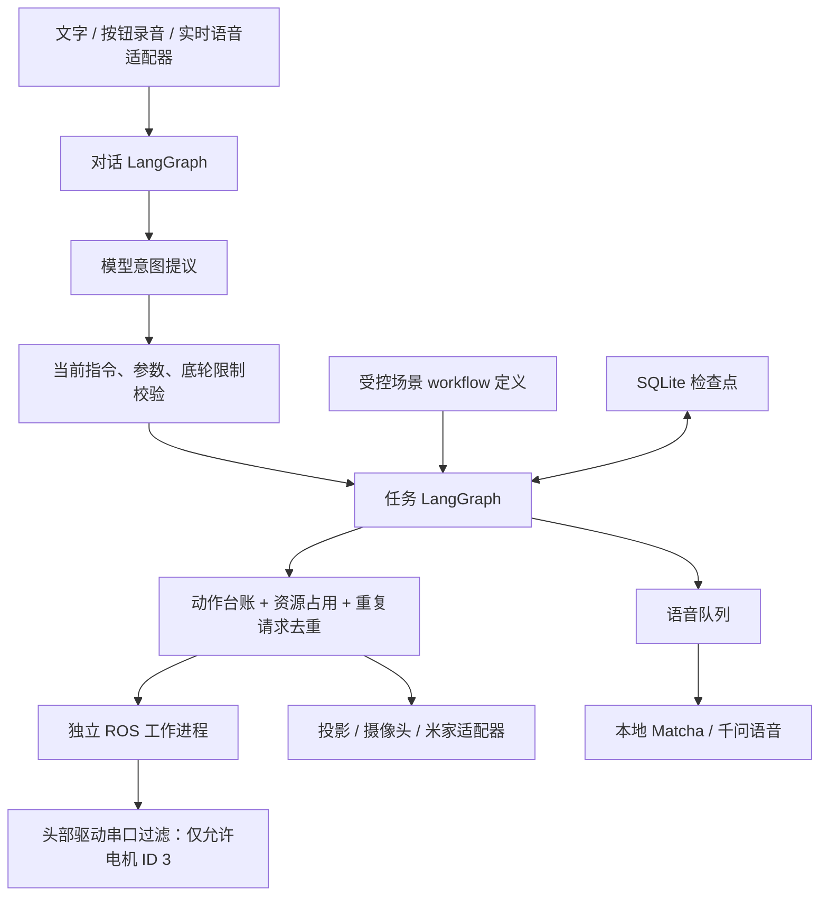

# Qwen Robot LangGraph

独立的新架构试验项目，机器人目录 `/home/test/qwen_robot_langgraph`。原来的语音项目和 `Car_real_copy` 代码保持不变。

这是可运行、已做原地实机验证的首版。**尚未覆盖旧项目的全部业务功能，也不代表模型理解准确率达到 95%。** 当前底轮运动始终禁止；没有 HTTP 参数、模型参数或启动开关可以解除它。包含导航的会议场景会被明确拒绝，原地会议场景必须显式选择。

## 已实现的职责分离



- `dialogue.py`：对话图，负责理解、校验、提交任务；精确的常用指令无需调用模型。
- `graphs.py`：长任务图，负责步骤推进、等待真实结果、暂停、继续、结束和清理。
- `workflows.py`：会议、原地运动、观察后投食等确定性流程定义。
- `execution.py` / `storage.py`：持久动作 ID、请求去重、事务资源占用、过期任务拦截、异常结果记录。
- `hardware.py` / `scripts/ros_action.py`：硬件适配器和常驻 ROS 通信，不在 LangGraph 虚拟环境里导入 ROS、摄像头或 NPU 驱动。
- `speech.py`：独立语音队列，播报播放结束不是抬头的前置条件；任务结束或取消会作废过期播报。
- `intent_policy.py`：把模型建议与当前请求核对，阻止把“不要开灯”转换成关灯，把指定角度转换成默认抬头等操作。
- `voice.py` / `local_audio.py`：云端实时语音适配器与本地 SenseVoice / Matcha；音频内容不进入图检查点。
- `hybrid.py`：本地 Qwen3-4B 优先。解析失败、结构/参数/本轮指令校验失败时请求云端；云端结果仍需校验，失败或预算不足时明确澄清。不会把模型自报置信度当作放行动作的依据。
- `realtime_model.py`：通过现有 Qwen-Audio 服务进行纯文本意图推理，不直接执行模型的工具建议。
- `cloud_budget.py`：跨进程、跨重启保存云端测试预算，上限 100；连接尝试也占名额，计数比实际生成轮次保守。

## 当前可用范围

| 功能 | 状态 |
|---|---|
| 原地会议投影、暂停、继续、结束及回正 | 已通过机器人实测 |
| 头部、雷达开关与扫描恢复、投影控制 | 已接入并实测 |
| 前后摄像头、喇叭、麦克风、本地 ASR/TTS | 已实测 |
| 当前时间、状态、文字控制台和录音按钮 | 已实现；时间使用 Asia/Shanghai |
| 完整会议导航流程 | 模拟验证；真实执行被底轮限制拦截 |
| 运动计数、观察宠物再投食 | 图流程及故障分支已模拟验证；视觉计数/宠物识别实机适配器尚未启用 |
| 米家灯和投食机 | 适配器已接入；检测到现有米家凭证过期，未宣称控制成功 |
| 旧版人脸库、提醒、天气、电影、完整 Android App 协议 | 尚未迁移 |
| 云端连续免按键对话 | 适配器存在；本次未完成长时间声学/打断验收，日常测试优先使用录音按钮 |

## 机器人上运行

已准备独立 `.venv`，原系统 Python 包未升级。驱动进程继续使用系统 Python 和现有 ROS 安装；LangGraph 使用固定版本依赖。

```bash
cd /home/test/qwen_robot_langgraph
# 只启动本项目的音频、ROS 通信、IMU、雷达、头部进程。
python3 scripts/hardware_services.py start
# 启动本机 Qwen3-4B，然后启动端云协同服务。已有进程时先用 status 检查。
python3 scripts/model_service.py start
python3 scripts/app_service.py start hybrid
```

服务只监听机器人 `127.0.0.1:18884`。在电脑上建立转发：

```bash
ssh -L 28884:127.0.0.1:18884 test@100.77.107.76
```

然后打开 `http://127.0.0.1:28884`。控制台支持文字、录音 4 秒、原地投影测试、任务状态、暂停、继续、结束及事件详情。启动测试前确认只有本项目占用硬件；同时运行第二个新架构实例会被硬件所有者锁拒绝。

原地投影测试按钮会在启动投影后保持 5 秒，再关闭投影、回正并恢复雷达。完整会议场景不会自动降级成原地投影。

常用文字：`原地会议投影`、`抬头`、`回正`、`前摄拍照`、`后摄拍照`、`现在几点`、`暂停`、`继续`、`结束会议`。未知或不完整参数会返回澄清，不会声称动作已经完成。

服务退出会请求活动任务结束并等待清理。按以下顺序停止本项目进程：

```bash
python3 scripts/app_service.py stop
python3 scripts/model_service.py stop
python3 scripts/hardware_services.py stop
```

默认模式为 **端云协同**：本地 Qwen3-4B → 必要时云端 Qwen → 当前指令/参数/硬件限制校验 → LangGraph 执行。`app_service.py` 默认关闭关键词、正则和固定指令等本地意图匹配；模型之后的参数核对、硬件安全校验和底轮锁仍然生效。ASR 使用本机 SenseVoice，TTS 使用本机 Matcha。云端参与文本意图推理，不承担默认录音或播报。

本地实际型号为 **Qwen3-4B**，上下文设置 4096，独立端口 18087。`model_service.py` 拒绝与已有 `rkllm3-server` 竞争。启动器支持 `start hybrid`（默认）、`start local`（仅本地、无云端回退）和 `start cloud`（原云端意图模式）。`/health` 显示当前模型、TTS、ASR 和预算，`runtime/hybrid_routes.jsonl` 记录本地/云端/澄清路由。模型权重、旧项目和旧提示词保持不变。

云端失败或达到本轮累计预算上限后，本地和精确规则仍可用，需要回退的请求会澄清。能够通过结构校验的语义错误仍可能漏过，这套回退机制不等于已经获得可靠的模型置信度判定。

## 测试与记录

```bash
PYTHONPATH=src .venv/bin/python -m pytest -q
# 纯模拟，不接触机器人硬件
PYTHONPATH=src .venv/bin/python -m robot_graph.cli --backend sim demo --seconds 1
```

实机测试脚本位于 `scripts/hardware_acceptance.py`、`scripts/scenario_acceptance.py`、`scripts/audio_acceptance.py`。前两者会操作头部/投影/雷达；不要与正在运行的服务同时执行。脚本不会导航，也不会发布底轮命令。

`runtime/` 中记录检查点、SQLite 动作台账、阶段事件、串口审计和验收报告。`requirements.lock` 固定了本次验证的依赖版本。

录音复测可运行 `PYTHONPATH=src .venv/bin/python scripts/stationary_audio_acceptance.py --output audio_check_日期`。
该脚本只做本地合成语音的喇叭→麦克风回环、报时/状态查询及播报忙碌保护检查，不执行头部收尾；要求现有云预算已耗尽，防止回归新增付费调用。它不代表真人语音盲测或其他硬件验收。
`GET /audio-status` 返回全局麦克风/喇叭资源、待播报数量和 `ready`，覆盖 `/tasks` 隐藏的内部播报与其他会话的音频占用，不返回其他会话内容。就绪仅是快照；客户端仍须处理 `/voice-turn` 的 `speaker_busy_try_after_playback` / `microphone_busy` 响应。服务在录音期间原子占用麦克风与喇叭，拒绝抢占未确认结束的播报。
两个原地 API 复测脚本均保存失败 HTTP 状态码和响应正文，并等待全局音频就绪。2026-09-08 接手复测的详细口径见 `docs/stationary_takeover_20260908.md`。

固定测试集为 `benchmarks/local_stack_240.json`（240 条不同指令）。`local_stack_benchmark.py` 分别测试文本和合成语音，硬件执行为模拟；`hybrid_benchmark.py` 复用同批本地结果评测有预算上限的云端回退；`hardware_voice_benchmark.py` 另做 48 条真实喇叭/麦克风和硬件试验。后三项结果必须分开统计，合成语音不等于真人语音。

## 故障语义与限制

1. `interrupt()` 只让图等待。真实设备仍由执行适配器完成或确认停止，不能把图暂停当作设备已停止。
2. 头部动作目前只能在反馈确认后暂停到步骤边界；不会伪称可以立即暂停任意头部动作。
3. 超时、丢失响应或进程重启后的硬件状态不明，会进入 `unknown` 并保留资源占用，不自动重发投食等动作。重启后的物理状态自动核实与恢复尚未做成完整产品流程；需要核实设备后处理，不能把它描述为自动恢复已完备。
4. 对同一个动作 ID 的节点重放会复用台账，不重复发送；这不等于底层设备协议支持 exactly-once。
5. 实机验收采用头部角度误差不超过 5°、角速度小于 1°/s 并持续 0.5 秒，且雷达恢复必须收到新的扫描。当前受限头部测试配置仍存在回正较慢及底层命令超时日志，需单独评估；本次没有宣称旧耗时问题已经解决。
6. 录音按钮使用本地 ASR，避免持续调用云端。模型意图测试与工程单元测试分别统计，不能把工程测试全部通过解释成自然语言准确率 95%。

## 原代码与私人配置

`vendor/` 是选定底层模块的独立副本，来源见 `vendor/PROVENANCE.json`。`prepare_robot.py` 仅向新目录生成私有配置和凭证副本，不覆盖原代码。模型资产与已安装的系统投影工具按现有路径读取。

`config/private*`、运行记录、音频、图像和模型资产不进入 Git。不要把运行目录或私有配置上传公开仓库。

实现依据：[LangGraph Graph API](https://docs.langchain.com/oss/python/langgraph/graph-api)、[Interrupts](https://docs.langchain.com/oss/python/langgraph/interrupts)、[Qwen-Audio 客户端事件](https://www.alibabacloud.com/help/en/model-studio/fun-audiochat-client-events)。
